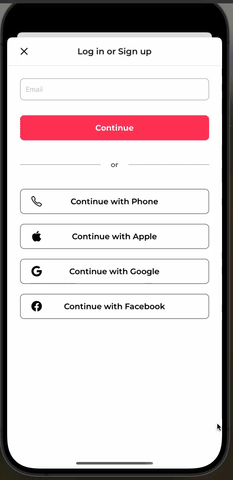
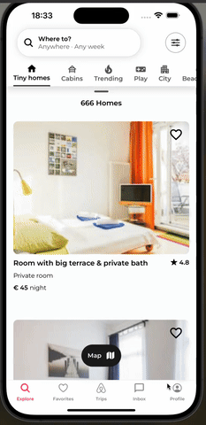

<h1>Airbnb Clone</h1>

This project comprises an Airbnb clone developed using React Native and Expo, integrating various modern libraries and packages. The project offers users fundamental Airbnb functionalities, including property searching, booking, and viewing property details. The application is developed with a focus on performance and modularity to ensure a user-friendly experience. It also includes advanced features like modern animations, maps, and user authentication. This Airbnb clone aims to provide a complete platform for accommodation search and booking.

<h2>Features</h2>

<ul>
    <li>Developed using React Native to create a modular and performant mobile application.</li>
    <li>State management is handled with Redux for predictable and maintainable application state.</li>
    <li>Expo Router is used for intuitive navigation within the app.</li>
    <li>React Native Reanimated provides smooth and complex animations for a better user experience.</li>
    <li>React Native Maps offers interactive and detailed maps to view property locations.</li>
    <li>User authentication and management are implemented using Clerk.</li>
    <li>Modern and user-friendly date picker functionality with React Native Modern Datepicker.</li>
</ul>

<h2>Screen Gif</h2>

    
    
    

